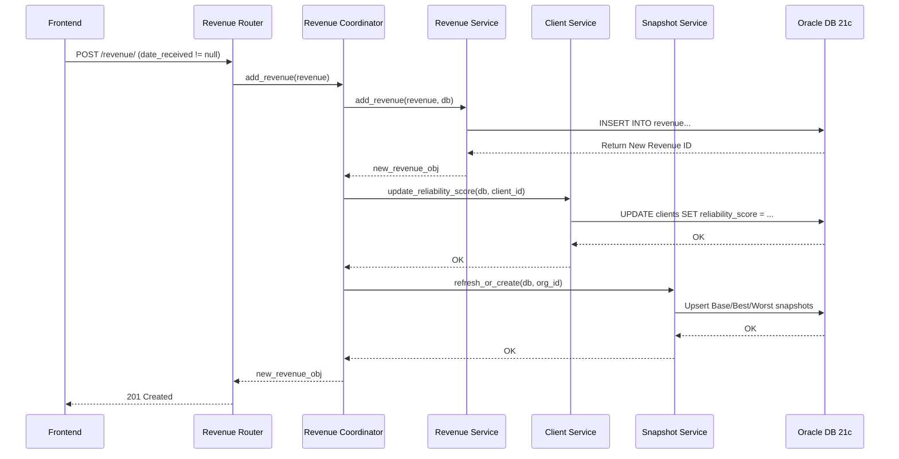

# RISCO Architecture (Current State)

## 3-Tier Boundary
RISCO operates on a monolithic 3-tier architecture:
1. **Frontend**: React (Vite + Tailwind) (located in the `/frontend` directory).
2. **Backend**: FastAPI (Python) serving a RESTful API (located in the `/backend` directory).
3. **Database**: Oracle Database 21c (PDB: `orcl21pdb`).

## Router -> Service -> Model Layering
The backend enforces a strict layering pattern to maintain separation of concerns:

- **Routers (`backend/routers/`)**: Act as the entry point for HTTP requests. They use Pydantic schemas (defined in `schema.py`) to validate incoming payloads. Routers are responsible for exception mapping: they catch plain Python exceptions (like `LookupError` or `ValueError`) raised by the Service layer and translate them into FastAPI `HTTPException` responses (e.g., 404 Not Found, 422 Unprocessable Entity). 
- **Services (`backend/services/`)**: Contain all business logic and pure data retrieval/modification logic. They raise standard Python exceptions when business rules or lookups fail.
- **Models (`backend/models.py`)**: Define the database tables using SQLAlchemy's declarative base.
- **Database Access & ORM**: By project requirement, the ORM query builder has been deliberately avoided in favor of raw SQL execution. Services interact with the database almost exclusively via `db.execute(text("..."))`.
- **Logging Boundary**: Logging is restricted to the Routers layer. Services do not log HTTP failures; instead, routers catch exceptions, log the failure (e.g., `logger.error("Failed to add expense")`), and return the HTTP response.

## The Coordinator Pattern
To prevent circular dependencies and decouple the heavy `FinancialSnapshots` logic from the standard `Revenue` and `Expense` services, the architecture uses a **Coordinator Pattern** (`backend/coordinators/`).

- The coordinators (`revenue_coordinator.py` and `expense_coordinator.py`) sit between the Routers and the Services.
- When a revenue or expense write occurs, the Router calls the Coordinator instead of the Service directly.
- The Coordinator first delegates the write to the respective Service.
- Upon success, the Coordinator then triggers cross-domain side-effects, specifically:
  - Calling `client_service.update_reliability_score()` (if revenue is marked as received).
  - Calling `snapshot_service.refresh_or_create()` to upsert the monthly financial snapshots.
- This boundary ensures that `revenue.py` and `expenses.py` services do not need to import or know about `snapshots.py` or `clients.py` logic.

## Oracle-Specific Constraints
Because the application is tied to Oracle Database 21c, the raw SQL in the Service layer is shaped by several Oracle-specific constraints:

1. **No `LIMIT` Clause**: Pagination relies on `OFFSET :offset ROWS FETCH NEXT 5 ROWS ONLY` instead of standard PostgreSQL/MySQL `LIMIT/OFFSET`.
2. **`NVL` over `COALESCE`**: Financial aggregations explicitly use Oracle's `NVL(SUM(amount), 0)` to handle null sums rather than the ANSI standard `COALESCE`.
3. **Reserved Words**: Standard column names that conflict with Oracle reserved words must be double-quoted in raw SQL (e.g., `"date"` in the expenses table).
4. **No `CREATE INDEX IF NOT EXISTS`**: Because Oracle lacks this syntax natively, index creation (e.g., in `init_db.py` or manual setup) is typically wrapped in `try/except` blocks to handle pre-existing indexes gracefully.

## Data Flow: Revenue Write to Snapshot
The following diagram illustrates a representative data flow using the Coordinator pattern, specifically detailing what happens when a user logs received revenue.

